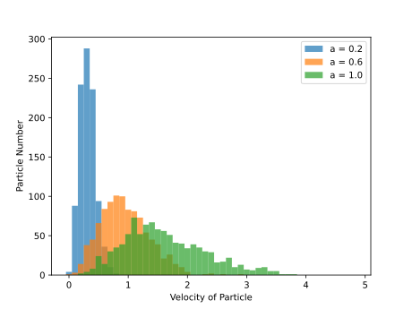
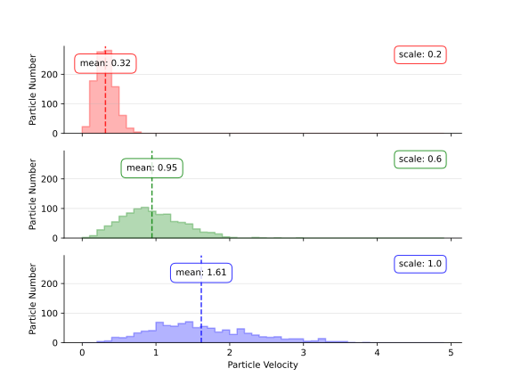
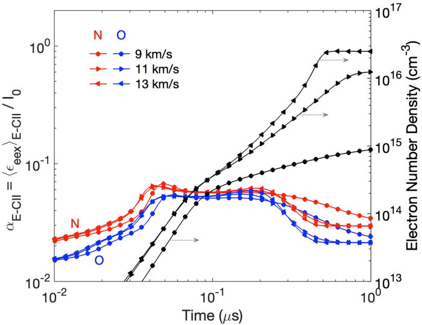
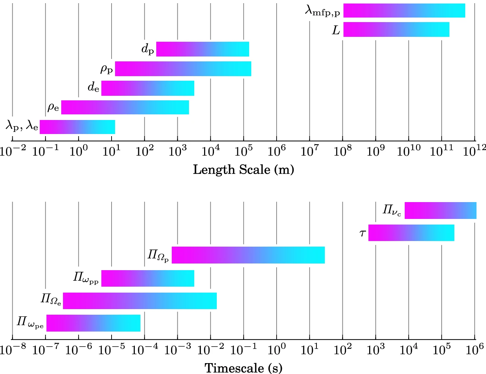

HW9 - PHYS661 - 25fall
Group: William Taranto

# 1.

I changed quite a bit from the original. The original had one main issue: the overlapping histograms was too visually complex. The overlapping plus transparancy lead to around 6 different colors being displayed. Parsing individual distributions was difficult under these conditions. I remedied this by splitting this into three separate, vertically stacked graphs. To prevent any distortion the same axes' limits were chosen for all three. Solving this problem created another: comparing distribution positions was now spacially separated. I solved this by plotting the means of the distributions to provide specific positions to compare to one another.

# 2.
## Bad

This plot shows the relationship between several things. The x axis is timescale of quasi-steady-state (vibration and disassociation are in equilibrium). The left y axis is the average electron energy per collision event normalized by ground state ionization energy. This corresponds to the N and O lines. The right y axis The black line is simply the electron number density which is indicated by the black line. Each line also has three variations each correspond to a different shock speed.
This plot is actually pretty good aside from the differentiation between shock speeds. It uses only a small marker along the lines for differentiation. When the data overlaps, these markers make separate shock velocities nearly indistinguishable. I think the simplest way to solve this would be through using a small multiples plot. This works very well as there are two different variables which the lines vary by (atom and velocity), so a matrix of plots can show the different combinations.
## Good

This plot shows the distribution of time and lengthscales for various solar wind quantities. The magenta side represents the typical value at the corona while the cyan represents the value at 1 au.
This plot is able to depice a wide variety of quantities and provide easy comparison between them. The use of color for distribution density is not problamatic here because the plot purpose is to show the rough behaviour of many quantities not the intricate behaviour of one.